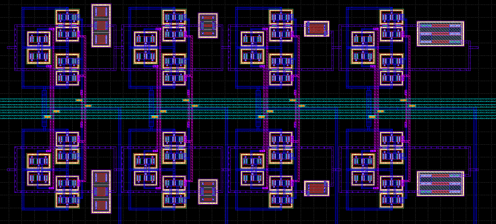
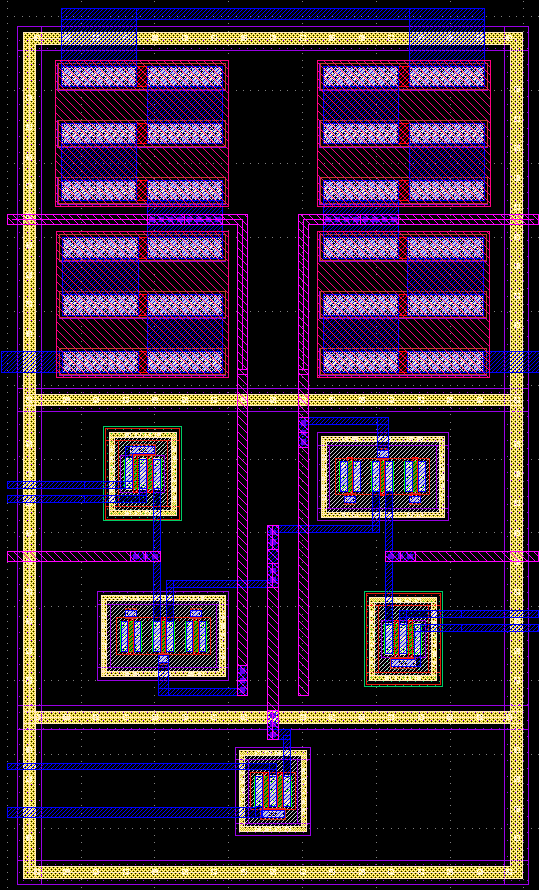
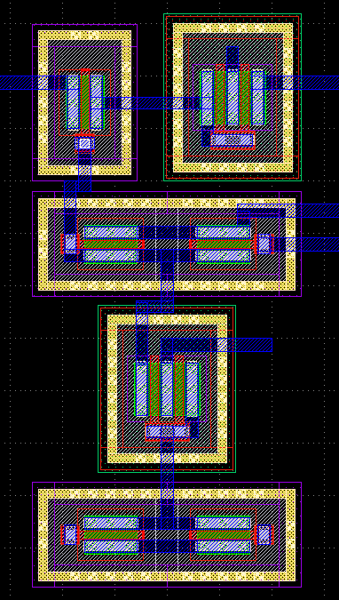

# Integrated Automatic Gain Control (AGC)

  

---

Automatic Gain Control project submission to the Google-funded Open-MPW program.

## Introduction

Automatic Gain Control (AGC) is a feedback loop used in receiver architectures for signal amplification. Its primary usage is in environments where the relative signal strength (RSS) is variable and could pose oversaturation on the receiving amplifier, such as that of radar recievers.

### Architecture

In order to achieve optimal amplification from the LNA, a digitally-stepped attenuator (DSA) is placed preceeding the LNA to attenuate any signal over a specific saturation threshold. After the signal is amplified, the output is coupled into a power detector (PD) circuit, which is then fed into an ADC and back into the DSA to drive the signal attenuation. Once the power detector is able to realize oversaturation at the output, it will drive the DSA to further attenuate the signal, reducing the power output. 

### Implementation

This AGC chip is part of a larger project; an FMCW radar for robotic applications. An AGC is paramount in radar applications where the distance between the antenna and the object for detection is unknown. If the object is further away than anticipated; amplification of the received signal will be needed. If it's too close; attenuation may be necessary to prevent 'blowout' of the reciever architecture. 

## Design

### Digitally-Stepped Attenuator

The digitally-stepped attenuator is comprised of 2 transmission gates and an inverter, effectively creating a SPDT switch. One throw leads to a fixed resistor value, the other goes directly to next stage. There are a total of 4 of these stages, each comprising a slightly higher attenuation than the previous stage. They are controlled via 4 control lines. It is setup in a pseudo-differential configuration to attenuate both phases. 

### Low-Noise Amplifier

The LNA is a fully-differential common-source amplfier with active loads and a tail current mirror. 

### Power Detector

The power detector works by taking the differential input, creating a self-mixed DC current proportinal to the input power, and mirroring it and convering it into a voltage. This gets sampled by an off-chip ADC and MCU to drive the DSA.  