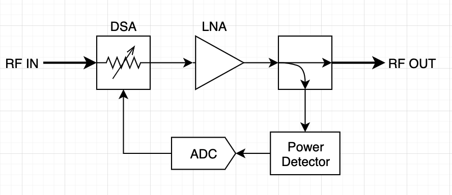

# Integrated Automatic Gain Control
   

--- 

## Introduction 

Automatic Gain Control is a feedback loop used in receiver architectures for dynamic signal amplification. Its primary usage is in environments where the relative signal strength is variable and could cause oversaturation, such as that of radar recievers. 

### Architecture 

 

In order to achieve optimal amplification from the LNA, a digitally-stepped attenuator is placed preceeding the LNA to attenuate any signal over a specific Vpp threshold. After the signal is amplified, the output is coupled into a power detector circuit, which is then fed into an ADC and back into the DSA to drive the signal attenuation. Once the power detector is able to realize oversaturation at the output, it will drive the DSA to further attenuate the signal, reducing the power output, and thus pulling the LNA output back out of oversaturation. 

### Implementation 

This AGC chip is part of a larger project; an FMCW radar for robotic applications. An AGC is paramount in radar applications where the distance between the antenna and the object for detection is unknown. If the object is further away than anticipated; amplification of the received signal will be needed. If it's too close; attenuation may be necessary to prevent 'blowout' of the reciever architecture. 
